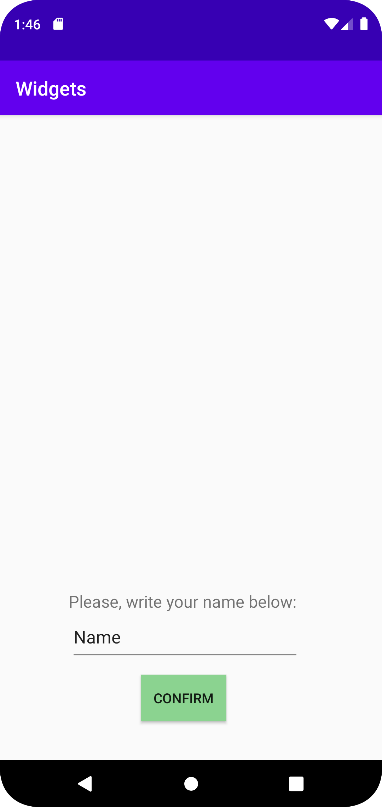

# Rapport

I denna uppgift har en layout skapats med hjälp av en imageview, en textview, en button och en edittext. Ändringarna gjordes i filen "active_main.xml". Appens uppbyggnad är inspirerad av en inloggningssida där både ett textfält och en insändningsknapp kan bli funnen. Filen "Strings.xml" har även blivit modifierad för att undvika hardcode text.

Nedan kan en kodsnutt bli funnen som visar koduppbyggnaden för en av de ovannämnda widgets:
```
 <TextView
            android:layout_width="wrap_content"
            android:layout_height="wrap_content"
            android:layout_marginEnd="88dp"
            android:layout_marginRight="88dp"
            android:layout_marginBottom="152dp"
            android:text="@string/text"
            android:textSize="17dp"
            app:layout_constraintBottom_toBottomOf="parent"
            app:layout_constraintEnd_toEndOf="parent" />
```

Bilder läggs i samma mapp som markdown-filen.



